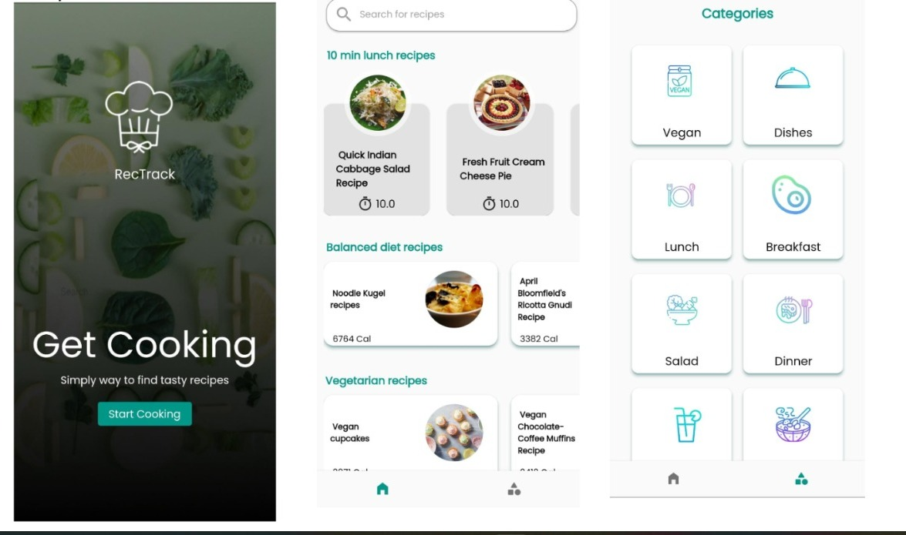

# RecTrack Mobile Application
[Demo](https://youtu.be/cHgapU9nlNw)
----
## Introduction
*****
RecTrack is your new cooking instructor! It is a food recipe application that lets you know how many calories are in a dish,
how long it takes to prepare it, the type of recipe, the ingredients, and how many healthy ingredients are in it. It also includes 
a classification of recipes on the categories page, including the most common ones, such as vegans and meals of the day.

## ScreenShots
*****

### Diagram
*****

## Technologies
*****
* Programming language : Flutter-Dart
* Data :  Edamam recipe Api
* Design : Figma
* Manegment :Jira

## Links
*****
* [Jira](https://aseel-hamayel.atlassian.net/jira/software/projects/REAC/issues/?filter=doneissues)
* [Figma](https://www.figma.com/file/qZbt5n8nhthxljdBZ6XhXd/RecTrack?node-id=0%3A1&t=uRvapZLrLCeFRIpC-1)
* [APK](https://drive.google.com/file/d/1reTVkX-JLsUoc2V9vf1_L_fM52swztAJ/view)

## Our Team
*****

=======
